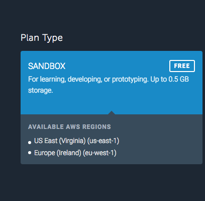
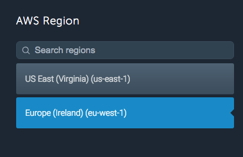
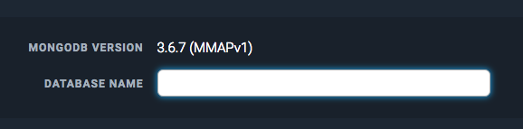
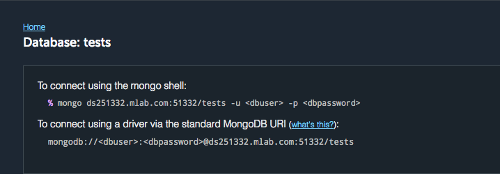
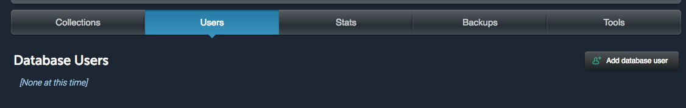

# jpa-mongodb
Create a Spring Boot Application that connects with MongoDB.

1. Create a free Mongo DB Hosting account on Mlab:

    https://mlab.com/signup/
    
2. Configure the datbase:

    * Create new database of SANDBOX Type
    
        
    
    * Select any region
    
        

    * Give a name to your DB
    
        
        
    * Once your database is created copy the uri and replace the value on your application.properties
    
        
        
    * Create a user and then replace the password and username values on the provided uri
    
        
                    